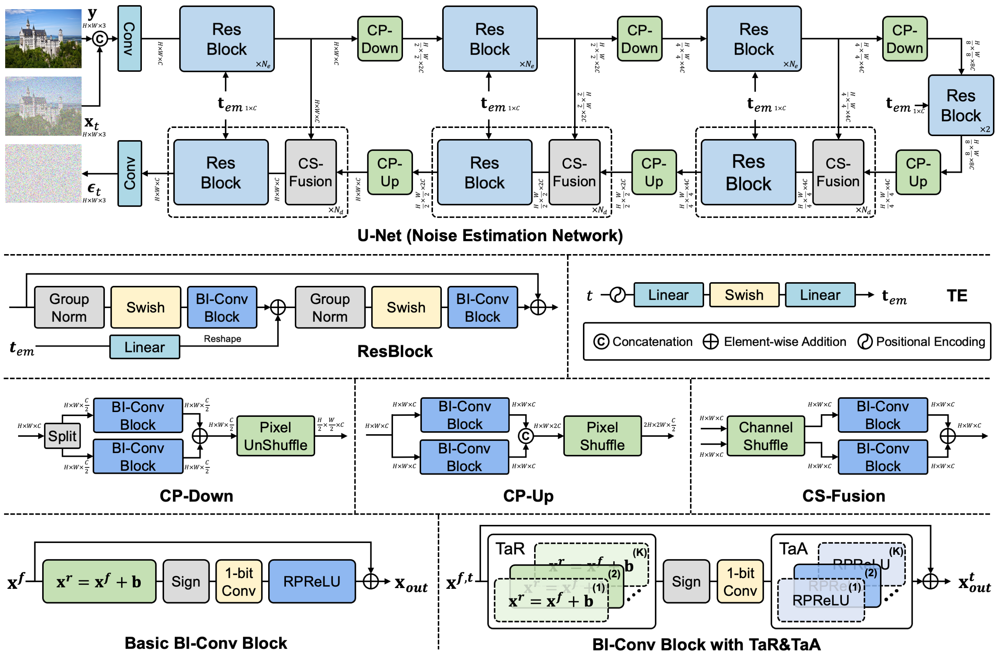
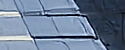
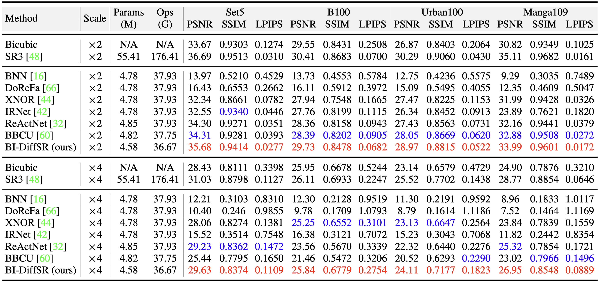

# Binarized Diffusion Model for Image Super-Resolution

[Zheng Chen](https://zhengchen1999.github.io/), [Haotong Qin](https://htqin.github.io/), [Yong Guo](https://www.guoyongcs.com/), [Xiongfei Su](https://ieeexplore.ieee.org/author/37086348852), [Xin Yuan](https://en.westlake.edu.cn/faculty/xin-yuan.html), [Linghe Kong](https://www.cs.sjtu.edu.cn/~linghe.kong/), and [Yulun Zhang](http://yulunzhang.com/), "Binarized Diffusion Model for Image Super-Resolution", NeurIPS, 2024

[[arXiv](https://arxiv.org/abs/2406.05723)] [[visual results](https://drive.google.com/drive/folders/1-Mfy8XHG55Bc19gAXqNaNitO0GEx7O1r?usp=drive_link)] [[pretrained models](https://drive.google.com/drive/folders/1hoHAG2yoLltloQ0SYv-QLxwk9Y8ZnTnH?usp=drive_link)]


#### 🔥🔥🔥 News

- **2024-10-14:** Code and pre-trained models are released. ⭐️⭐️⭐️
- **2024-09-26:** BI-DiffSR is accepted at NeurIPS 2024. 🎉🎉🎉
- **2024-06-09:** This repo is released.

---

> **Abstract:** Advanced diffusion models (DMs) perform impressively in image super-resolution (SR), but the high memory and computational costs hinder their deployment. Binarization, an ultra-compression algorithm, offers the potential for effectively accelerating DMs. Nonetheless, due to the model structure and the multi-step iterative attribute of DMs, existing binarization methods result in significant performance degradation. In this paper, we introduce a novel binarized diffusion model, BI-DiffSR, for image SR. First, for the model structure, we design a UNet architecture optimized for binarization. We propose the consistent-pixel-downsample (CP-Down) and consistent-pixel-upsample (CP-Up) to maintain dimension consistent and facilitate the full-precision information transfer. Meanwhile, we design the channel-shuffle-fusion (CS-Fusion) to enhance feature fusion in skip connection. Second, for the activation difference across timestep, we design the timestep-aware redistribution (TaR) and activation function (TaA). The TaR and TaA dynamically adjust the distribution of activations based on different timesteps, improving the flexibility and representation alability of the binarized module. Comprehensive experiments demonstrate that our BI-DiffSR outperforms existing binarization methods.



---

---

|                            HR                             |                              LR                              | [SR3 (FP)](https://github.com/Janspiry/Image-Super-Resolution-via-Iterative-Refinement) |          [BBCU](https://github.com/Zj-BinXia/BBCU)          |                       BI-DiffSR (ours)                       |
| :-------------------------------------------------------: | :----------------------------------------------------------: | :----------------------------------------------------------: | :---------------------------------------------------------: | :----------------------------------------------------------: |
|  |  |    |  |  |
|  |  |    |  |  |

## TODO

* [x] Release code and pretrained models

## Dependencies

- Python 3.9
- PyTorch 1.13.1+cu117

```bash
# Clone the github repo and go to the default directory 'BI-DiffSR'.
git clone https://github.com/zhengchen1999/BI-DiffSR.git
conda create -n bi_diffsr python=3.9
conda activate bi_diffsr
pip install -r requirements.txt -f https://download.pytorch.org/whl/torch_stable.html
git clone https://github.com/huggingface/diffusers.git
cd diffusers
pip install -e ".[torch]"
```

## Contents

1. [Datasets](#datasets)
1. [Models](#models)
1. [Training](#training)
1. [Testing](#testing)
1. [Results](#results)
1. [Citation](#citation)
1. [Acknowledgements](#acknowledgements)

## <a name="datasets"></a> Datasets

Used training and testing sets can be downloaded as follows:

| Training Set                                                 |                         Testing Set                          |                        Visual Results                        |
| :----------------------------------------------------------- | :----------------------------------------------------------: | :----------------------------------------------------------: |
| [DIV2K](https://data.vision.ee.ethz.ch/cvl/DIV2K/) (800 training images, 100 validation images) +  [Flickr2K](https://cv.snu.ac.kr/research/EDSR/Flickr2K.tar) (2650 images) [complete training dataset DF2K: [Google Drive](https://drive.google.com/file/d/1TubDkirxl4qAWelfOnpwaSKoj3KLAIG4/view?usp=share_link) / [Baidu Disk](https://pan.baidu.com/s/1KIcPNz3qDsGSM0uDKl4DRw?pwd=74yc)] | Set5 + Set14 + BSD100 + Urban100 + Manga109 [complete testing dataset: [Google Drive](https://drive.google.com/file/d/1yMbItvFKVaCT93yPWmlP3883XtJ-wSee/view?usp=sharing) / [Baidu Disk](https://pan.baidu.com/s/1Tf8WT14vhlA49TO2lz3Y1Q?pwd=8xen)] | [Google Drive](https://drive.google.com/drive/folders/1ZMaZyCer44ZX6tdcDmjIrc_hSsKoMKg2?usp=drive_link) / [Baidu Disk](https://pan.baidu.com/s/1LO-INqy40F5T_coAJsl5qw?pwd=dqnv#list/path=%2F) |

Download training and testing datasets and put them into the corresponding folders of `datasets/`.

## <a name="models"></a> Models

| Method    | Params (M) | FLOPs (G) | PSNR (dB) | LPIPS  |                          Model Zoo                           |                        Visual Results                        |
| :-------- | :--------: | :-------: | :-------: | :----: | :----------------------------------------------------------: | :----------------------------------------------------------: |
| BI-DiffSR |    4.58    |   36.67   |   24.11   | 0.1823 | [Google Drive](https://drive.google.com/drive/folders/1hoHAG2yoLltloQ0SYv-QLxwk9Y8ZnTnH?usp=sharing) | [Google Drive](https://drive.google.com/drive/folders/1-Mfy8XHG55Bc19gAXqNaNitO0GEx7O1r?usp=sharing) |

The performance is reported on Urban100 (×4). Output size of FLOPs is 3×256×256.

## <a name="training"></a> Training

- The ×2 task requires **4*8 GB** VRAM, and the ×4 task requires **4*20 GB** VRAM.

- Download [training](https://drive.google.com/file/d/1TubDkirxl4qAWelfOnpwaSKoj3KLAIG4/view?usp=share_link) (DF2K, already processed) and [testing](https://drive.google.com/file/d/1yMbItvFKVaCT93yPWmlP3883XtJ-wSee/view?usp=sharing) (Set5, BSD100, Urban100, Manga109, already processed) datasets, place them in `datasets/`.

- Run the following scripts. The training configuration is in `options/train/`.

  ```shell
  # BI-DiffSR, input=64x64, 4 GPUs
  python -m torch.distributed.launch --nproc_per_node=4 --master_port=4321 train.py -opt options/train/train_BI_DiffSR_x2.yml --launcher pytorch
  python -m torch.distributed.launch --nproc_per_node=4 --master_port=4321 train.py -opt options/train/train_BI_DiffSR_x4.yml --launcher pytorch
  ```
  
- The training experiment is in `experiments/`.

## <a name="testing"></a> Testing

- Download the pre-trained [models](https://drive.google.com/drive/folders/1hoHAG2yoLltloQ0SYv-QLxwk9Y8ZnTnH?usp=sharing) and place them in `experiments/pretrained_models/`.

  We provide pre-trained models for image SR (×2, ×4).

- Download [testing](https://drive.google.com/file/d/1yMbItvFKVaCT93yPWmlP3883XtJ-wSee/view?usp=sharing) (Set5, BSD100, Urban100, Manga109) datasets, place them in `datasets/`.

- Run the following scripts. The testing configuration is in `options/test/`.

  ```shell
  # BI-DiffSR, reproduces results in Table 2 of the main paper
  python test.py -opt options/test/test_BI_DiffSR_x2.yml
  python test.py -opt options/test/test_BI_DiffSR_x4.yml
  ```
  
  Due to the randomness of diffusion model ([diffusers](https://huggingface.co/docs/diffusers)), results may slightly vary.
  
- The output is in `results/`.

## <a name="results"></a> Results

We achieved state-of-the-art performance. Detailed results can be found in the paper.

<details>
<summary>Quantitative Comparisons (click to expand)</summary>

- Results in Table 2 (main paper)

<p align="center">
  
</p>
</details>


<details>
<summary>Visual Comparisons (click to expand)</summary>


- Results in Figure 8 (main paper)

<p align="center">
  
</p>


- Results in Figure 13 (supplemental material)

<p align="center">
  
  
</p>


- Results in Figure 14 (supplemental material)

<p align="center">
  
  
</p>

</details>


## <a name="citation"></a> Citation

If you find the code helpful in your research or work, please cite the following paper(s).

```
@inproceedings{chen2024binarized,
    title={Binarized Diffusion Model for Image Super-Resolution},
    author={Chen, Zheng and Qin, Haotong and Guo, Yong and Su, Xiongfei and Yuan, Xin and Kong, Linghe and Zhang, Yulun},
    booktitle={NeurIPS},
    year={2024}
}
```


## <a name="acknowledgements"></a> Acknowledgements

This code is built on [BasicSR](https://github.com/XPixelGroup/BasicSR), [Image-Super-Resolution-via-Iterative-Refinement](https://github.com/Janspiry/Image-Super-Resolution-via-Iterative-Refinement).
